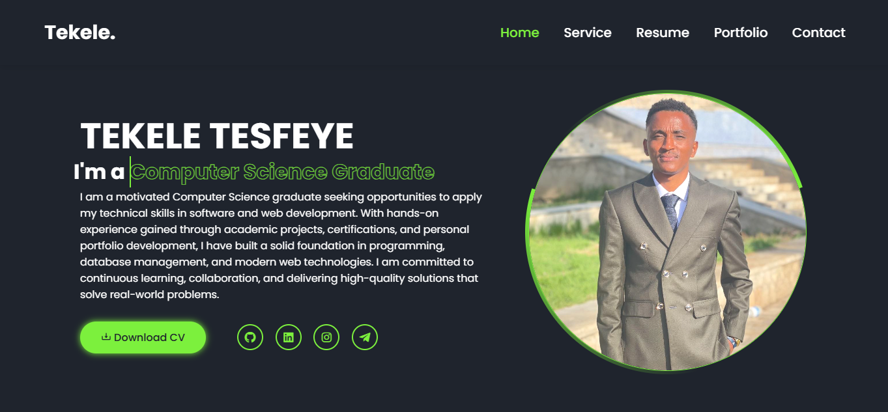
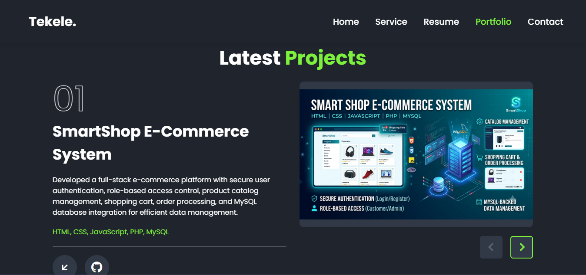
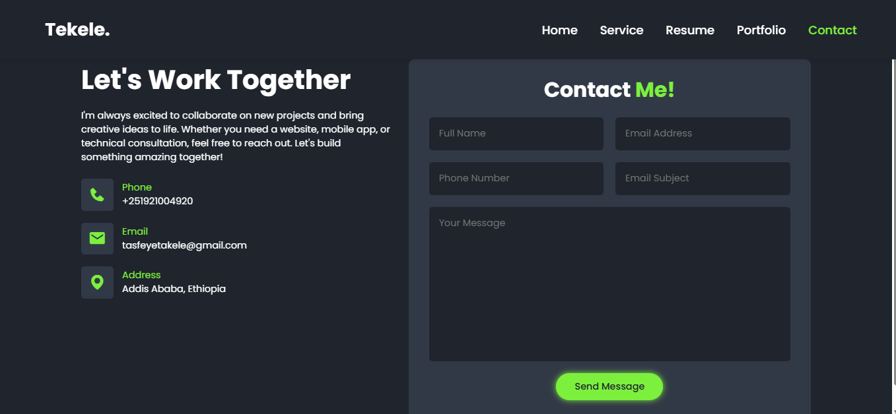

# Portfolio Website

A personal portfolio website representing my professional profile as a Computer Science graduate and software developer — built to showcase my skills, projects, experience, and certifications to potential employers and collaborators.

🔗 **Live Demo:** [https://teke28.github.io/portfolio/](https://teke28.github.io/portfolio/)

---

## About The Project

This portfolio serves as my digital resume and professional showcase. It is designed to:

- Present a clear, organized overview of my software development skills and technical background.
- Highlight the projects I've built, the technologies I've worked with, and my professional experience.
- Provide an easy way for recruiters, collaborators, or potential employers to get in touch with me directly through an integrated contact form.
- Deliver a fully responsive experience across desktop, tablet, and mobile devices, ensuring a consistent and polished look on any screen size.

## Features

- 🎨 Responsive, modern UI design
- 🏠 Home / landing section
- 👤 About Me section
- 🛠️ Skills showcase
- 💼 Projects section
- 📈 Experience section
- 🎓 Certificates section
- ✉️ Contact form integration using Formspree
- ✨ Smooth navigation and animations
- 📱 Mobile-friendly layout

## Technologies Used

- **HTML5** – semantic structure and markup
- **CSS3** – styling, layout, and responsive design
- **JavaScript** – interactivity and dynamic behavior
- **Boxicons** – icon library used throughout the UI
- **Formspree API** – handles contact form submissions without a backend

## Project Structure

```
portfolio/
│── index.html
│── style.css
│── script.js
│── README.md
```

## Contact Form

The contact form on this website is powered by **Formspree**, allowing visitors to send messages directly to my inbox without needing a custom backend.

- **Formspree Endpoint:** `https://formspree.io/f/xaqrqykn`

## Screenshots

> Add screenshots of the website here to give visitors a quick visual preview.

| Home Page | Projects Section | Contact Form |
|-----------|------------------|---------------|
| ** | ** | ** |

## Installation and Setup

To run this project locally:

1. **Clone the repository**
   ```bash
   git clone https://github.com/teke28/portfolio.git
   ```
2. **Open the project folder**
   ```bash
   cd portfolio
   ```
3. **Run the project**
   Open `index.html` directly in your browser, or use a live server extension (e.g., VS Code Live Server) for the best experience.

## Deployment

This project can be deployed using any static site hosting service, including:

- **GitHub Pages** – free and simple hosting directly from the repository (currently used for the live demo).
- **Netlify** – drag-and-drop or Git-based continuous deployment.
- **Vercel** – fast, git-integrated static site deployment.

## Future Improvements

- 🔧 Backend integration for dynamic content management
- 📝 Blog section to share technical articles and project updates
- 🌗 Improved dark/light theme toggle
- 📂 Additional projects and case studies as my portfolio grows

## Author

**Tekele Tesfeye**
Computer Science Graduate | Software Developer

- GitHub: [github.com/teke28](https://github.com/teke28)
- LinkedIn: [https://www.linkedin.com/in/tekele-tesfeye-36ba5a419](https://www.linkedin.com/in/tekele-tesfeye-36ba5a419)
- Email: tasfeyetakele@gmail.com

## License


This project is a personal portfolio website created by Tekele Tesfeye.

The source code is available for viewing and learning purposes. 
Reuse, modification, or redistribution of this project requires permission from the owner.